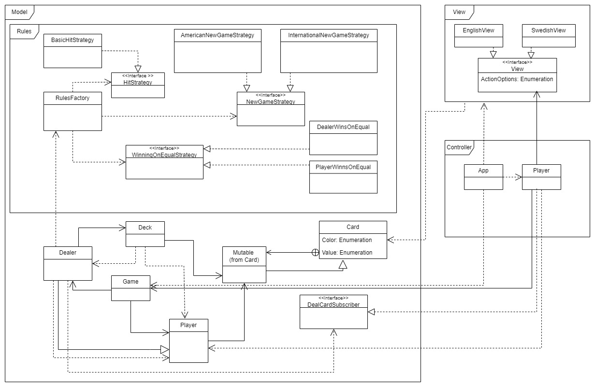

# Black Jack Game

## Project Overview

This project is a console-based implementation of the Black Jack card game using Object-Oriented principles. The application follows the **Model-View-Controller (MVC)** architectural pattern, which separates the internal representations of the information (Model), how it is presented to the user (View), and how the user interacts with it (Controller). The design is built to allow flexibility for future changes in game rules and player strategies.

The game allows players to engage in a simulated Black Jack game, following common Black Jack rules with additional options for custom rules, such as the soft 17 rule and customizable win conditions when there is a tie.

### Features
- **Modular design** using MVC principles to decouple game logic, presentation, and user interaction.
- **Configurable game rules**: Easily switch between different strategies for when to hit, how new games start, and who wins on a tie.
- **Support for international game rules**: Choose between American and international game styles.
- **Console-based user interface**: Available in both English and Swedish views.

## Class Diagram



The class diagram shows the relationships between different components of the game, organized into **Model**, **View**, and **Controller** packages. 

## How to Build the Project

To build the project using Gradle, execute the following command in the terminal:

```bash
./gradlew build
```

This will compile the source code and run the tests, preparing the application for execution.

## How to Run the Game

After successfully building the project, you can run the game with:

```bash
./gradlew run -q --console=plain
```

## How to Play

Once the game is running, you can interact with it through the following commands:

- **p** - Start a new game
- **h** - Draw another card (Hit)
- **s** - End your turn (Stand)
- **q** - Quit the game

## Rules of Black Jack

The main objective of the game is to get as close to **21** as possible without exceeding it. The card values are as follows:
- **Cards 2-9** are worth their face value.
- **10, J, Q, K** are worth **10** points each.
- **Aces (A)** can be worth **1** or **11**, whichever is more advantageous to the player’s hand.

### Soft 17 Rule

The game employs the **soft 17** rule. This means that if the dealer has a hand containing an Ace and any combination of cards that adds up to 17 (where the Ace is counted as 11), the dealer is required to draw another card. This rule is in contrast to the standard rule where the dealer would stand on a hard 17.

### Winning on Equal Score

When the player and dealer have the same score, a custom rule determines who wins:
- In one mode, the **Dealer wins**.
- In another mode, the **Player wins**.
The current implementation uses the rule where **the player wins on a tie**.

## Game Strategies

The game uses several **strategy patterns** to customize behavior:

- **Hit Strategy (`BasicHitStrategy`)**: The dealer hits until their score reaches 17, but will also hit on a soft 17 (an Ace and a 6).
- **New Game Strategy (`AmericanNewGameStrategy`)**: Follows American Black Jack rules, where the dealer’s second card is dealt face-down.
- **Winning on Equal Strategy (`PlayerWinsOnEqual`)**: The player wins if the scores are tied, unless the dealer’s score is higher.

## Design Overview

The application is designed with a focus on flexibility and reusability. The **Model-View-Controller (MVC)** pattern allows easy modification and extension of different parts of the game. Here's a brief overview of each part:

### Model
The **Model** represents the core game logic:
- `Game`: Handles the overall game flow and interactions between the player and the dealer.
- `Player` and `Dealer`: Represent the participants in the game, each with a hand of cards.
- `Deck`: Represents the deck of cards used in the game, including shuffling and dealing functionality.
- **Rules**: Includes various strategies for game behavior, such as:
  - **Hit Strategy**: Determines when the dealer should draw another card.
  - **New Game Strategy**: Defines the conditions for starting a new game.
  - **Winning on Equal Strategy**: Decides who wins when the player and dealer have the same score.

### View
The **View** provides the interface for user interaction. The game supports multiple languages:
- `EnglishView`: Displays messages and prompts in English.
- `SwedishView`: Displays messages and prompts in Swedish.
The views are designed to be passive, meaning they only display information when prompted by the controller.

### Controller
The **Controller** (`Player.java`) manages the game flow by taking input from the view and applying the corresponding actions in the model. It coordinates the interaction between the user and the game logic, ensuring that the game behaves as expected.

## Authors

- **Maria Fredriksson** (mf223wk)
- **Maddelen Hedenström** (mh222vu)
